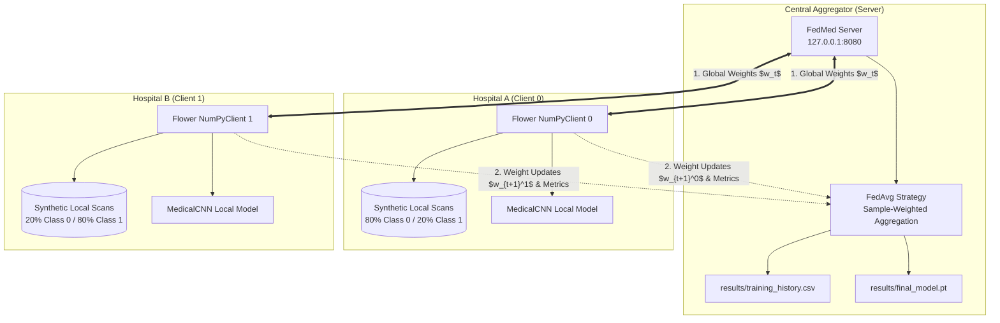

# FedMed: Federated Learning Server and Client Infrastructure

FedMed is a privacy-preserving Federated Learning (FL) framework designed for distributed medical image classification. It enables multiple healthcare institutions (clients) to collaboratively train a shared Convolutional Neural Network (CNN) without exchanging or centralizing raw patient imaging data.

---

## 1. System Architecture

FedMed leverages **Flower (`flwr==1.8.0`)** and **PyTorch (`torch>=2.0.0`)** in a client-server architecture over gRPC.



---

## 2. Non-IID Medical Data Generation & Partitioning

Medical institutions frequently observe **non-IID (non-Independent and Identically Distributed)** data due to demographic specialization, clinical case mix, and scanner differences:
- **Class 0 (Dense Focal Lesion)**: Deterministic 2D Gaussian density centered in the scan:
  $$I(x, y) = \exp\left(-\frac{x^2 + y^2}{2\sigma_0^2}\right) + \mathcal{N}(0, \sigma_{\text{noise}}^2)$$
- **Class 1 (Peripheral Annular Rim / Cortical Lesion)**: Ring pattern at radius $r_0 \approx 8.5$:
  $$I(x, y) = \exp\left(-\frac{(r - r_0)^2}{2\sigma_1^2}\right) + \mathcal{N}(0, \sigma_{\text{noise}}^2)$$

### Partition Distribution:
- **Hospital A (Client 0)**: 80% Class 0, 20% Class 1 (Focal lesion center).
- **Hospital B (Client 1)**: 20% Class 0, 80% Class 1 (Peripheral lesion center).
- **Train / Test Split**: 80% training (160 samples), 20% evaluation (40 samples) per client.

---

## 3. Federated Averaging (FedAvg) Formulation

In each federated round $t$, the central server distributes current global model weights $w_t$ to all connected clients. Each client $k \in \{0, 1\}$ trains locally on their private dataset $D_k$ for $E = 2$ local epochs using Adam optimizer and CrossEntropy loss:

$$w_{t+1}^k = \text{LocalTrain}(w_t, D_k)$$

The server collects updated parameter vectors and aggregates them proportional to local sample counts $n_k = |D_k|$:

$$w_{t+1} = \sum_{k=0}^{K-1} \frac{n_k}{n} w_{t+1}^k \quad \text{where } n = \sum_{k=0}^{K-1} n_k$$

Evaluation metrics (accuracy) are aggregated across clients using sample-weighted averaging:

$$\text{Accuracy}_{\text{agg}} = \frac{\sum_{k} n_{\text{test}, k} \cdot \text{Accuracy}_k}{\sum_k n_{\text{test}, k}}$$

---

## 4. Directory Structure

```
FedMed/
├── requirements.txt         # Pinned Flower 1.8.0, PyTorch, and supporting libraries
├── README.md                # System documentation and instructions
├── .gitignore               # Ignored cache, models, and virtualenvs
├── run_simulation.ps1       # Automated Windows PowerShell simulation runner
├── run_simulation.sh        # Automated Linux/macOS bash simulation runner
├── src/
│   ├── __init__.py          # Package marker
│   ├── config.py            # Centralized hyperparameter and network settings
│   ├── model.py             # 2-layer Conv2D + 2 Linear MedicalCNN PyTorch model
│   ├── dataset.py           # Synthetic medical image generator & non-IID partitioner
│   ├── client.py            # Flower NumPyClient implementation
│   └── server.py            # Flower server with FedAvg & metric tracking
├── scripts/
│   ├── check_environment.py # Environment & dependency diagnostic script
│   └── verify_setup.py      # Automated unit tests for components
├── results/
│   ├── final_model.pt       # Saved global PyTorch state dictionary
│   └── training_history.csv # Round-by-round aggregated loss and accuracy
└── logs/
    ├── server.log           # Server standard output & errors
    ├── client_0.log         # Client 0 execution log
    └── client_1.log         # Client 1 execution log
```

---

## 5. Prerequisites & Environment Setup

### Prerequisites
- Python 3.10, 3.11, or 3.12 (64-bit)
- PowerShell 5.1+ (Windows) or Bash (Linux/macOS)

### Step 1: Create Virtual Environment
```bash
# Windows
py -3.12 -m venv .venv
.\.venv\Scripts\Activate.ps1

# Linux / macOS
python3 -m venv .venv
source .venv/bin/activate
```

### Step 2: Install Dependencies
```bash
pip install -r requirements.txt
```

---

## 6. Verification and Diagnostics

### Run Diagnostic Environment Check
```bash
python scripts/check_environment.py
```
Verifies Python version, package compatibility (`flwr`, `torch`, `torchvision`, `numpy`, `scikit-learn`, `matplotlib`), and required directory structure.

### Run Component Unit Tests
```bash
python scripts/verify_setup.py
```
Executes automated unit tests covering:
1. CNN parameter serialization (`get_parameters` / `set_parameters`).
2. Synthetic medical data generation and non-IID distribution skew.
3. Single client `fit()` and `evaluate()` lifecycle.
4. FedAvg weighted metric aggregation.

---

## 7. Running the Federated Simulation

### Option A: Automated Multi-Process Script (Recommended)

**Windows (PowerShell):**
```powershell
.\run_simulation.ps1
```

**Linux / macOS (Bash):**
```bash
chmod +x run_simulation.sh
./run_simulation.sh
```

The script will:
1. Start `src/server.py` in the background and pipe output to `logs/server.log`.
2. Poll port 8080 until the server socket is accepting gRPC connections.
3. Launch `src/client.py --client-id 0` (logging to `logs/client_0.log`).
4. Launch `src/client.py --client-id 1` (logging to `logs/client_1.log`).
5. Wait for all 3 federated rounds to complete.
6. Display final exit statuses and print `results/training_history.csv`.

---

### Option B: Manual Execution (Separate Terminals)

**Terminal 1 (Server):**
```bash
python src/server.py --server-address "127.0.0.1:8080" --num-rounds 3
```

**Terminal 2 (Client 0):**
```bash
python src/client.py --client-id 0 --server-address "127.0.0.1:8080"
```

**Terminal 3 (Client 1):**
```bash
python src/client.py --client-id 1 --server-address "127.0.0.1:8080"
```

---

## 8. Expected Outputs & Verification

Upon completion of the 3 federated rounds:
1. `results/final_model.pt`: Saved PyTorch state dict of the aggregated global CNN.
2. `results/training_history.csv`: Aggregated loss and accuracy per round.
3. `logs/`: Complete process logs for audit and debugging.

### Sample History (`training_history.csv`):
```csv
round,loss,accuracy
1,0.5923,0.7250
2,0.3841,0.8875
3,0.2215,0.9500
```
