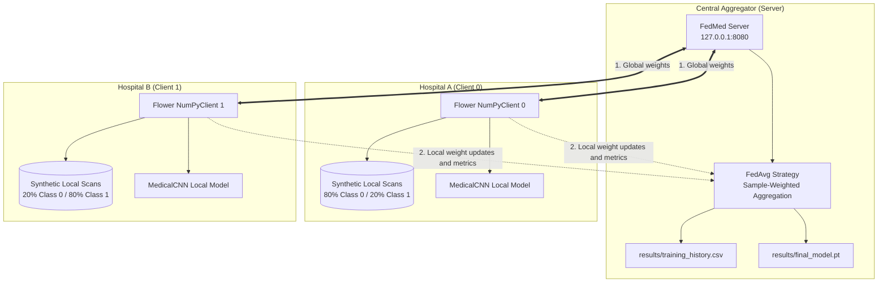

# FedMed: Federated Learning Server and Client Infrastructure

FedMed is a privacy-preserving Federated Learning (FL) framework for distributed medical image classification. It enables multiple healthcare institutions (clients) to collaboratively train a shared Convolutional Neural Network (CNN) without exchanging or centralizing raw patient imaging data.

> **Note:** This project uses synthetic medical images to demonstrate federated training. It is an educational prototype, not a clinically validated diagnostic system. Federated learning reduces the need to share raw data, but it does not guarantee complete privacy by itself.

---

## 1. System Architecture

FedMed uses **Flower (`flwr==1.8.0`)** and **PyTorch (`torch>=2.0.0`)** in a client-server architecture over gRPC.



### Workflow

1. The server initializes the global model and starts the Flower server.
2. Each hospital client receives the current global model parameters.
3. Each client trains locally using only its own dataset.
4. Clients return model parameter updates and evaluation metrics. Raw images remain local.
5. The server aggregates the updates using Federated Averaging (FedAvg).
6. The server records training metrics and saves the final global model.

---

## 2. Synthetic Non-IID Medical Data Generation

Medical institutions can have different data distributions because of differences in patient populations, clinical case mix, and imaging equipment. FedMed simulates this non-IID setting with two classes of synthetic 2D scans.

### Class 0: Dense Focal Lesion

A Gaussian-shaped density centered in the scan:

\[
I(x,y)=\exp\left(-\frac{x^2+y^2}{2\sigma_0^2}\right)
+\mathcal{N}(0,\sigma_{\text{noise}}^2)
\]

### Class 1: Peripheral Annular Rim / Cortical Lesion

A ring pattern centered around radius \(r_0 \approx 8.5\):

\[
I(x,y)=\exp\left(-\frac{(r-r_0)^2}{2\sigma_1^2}\right)
+\mathcal{N}(0,\sigma_{\text{noise}}^2)
\]

### Client Data Distribution

| Client | Simulated Institution | Class 0 | Class 1 |
|---|---|---:|---:|
| Client 0 | Hospital A | 80% | 20% |
| Client 1 | Hospital B | 20% | 80% |

Each client has **200 samples**:

- Training data: 160 samples (80%)
- Evaluation data: 40 samples (20%)

This distribution simulates a non-IID environment where different hospitals have different proportions of medical image classes.

---

## 3. Federated Averaging (FedAvg)

For each federated round \(t\), the server distributes the current global model parameters \(w_t\) to each client \(k\).

Each client trains locally for **2 epochs** using the Adam optimizer and Cross-Entropy loss:

\[
w_{t+1}^{k}=\operatorname{LocalTrain}(w_t,D_k)
\]

The server aggregates the client parameters in proportion to each client's number of training samples \(n_k=|D_k|\):

\[
w_{t+1}=\sum_{k=0}^{K-1}\frac{n_k}{n}w_{t+1}^{k},
\qquad n=\sum_{k=0}^{K-1}n_k
\]

Evaluation accuracy is aggregated using the number of evaluation samples at each client:

\[
\operatorname{Accuracy}_{\text{agg}}=
\frac{\sum_k n_{\text{test},k}\operatorname{Accuracy}_k}
{\sum_k n_{\text{test},k}}
\]

The simulation is configured to run for **3 federated rounds**.

### FedAvg Process

1. The server sends the global model to participating clients.
2. Each client trains the model on its local training data.
3. Each client returns updated model parameters.
4. The server calculates a sample-weighted average of the updates.
5. The aggregated model becomes the global model for the next round.

---

## 4. Project Directory Structure

```text
FedMed/
├── requirements.txt              # Flower, PyTorch, and dependency requirements
├── README.md                     # Project documentation
├── dashboard.py                  # Streamlit interactive dashboard
├── .gitignore                    # Ignore rules for caches, models, and virtual environments
├── run_simulation.ps1            # Windows PowerShell simulation runner
├── run_simulation.sh              # Linux/macOS Bash simulation runner
│
├── src/
│   ├── __init__.py                # Python package marker
│   ├── config.py                  # Hyperparameters and network settings
│   ├── model.py                   # MedicalCNN PyTorch model
│   ├── dataset.py                 # Synthetic image generator and non-IID partitioner
│   ├── client.py                  # Flower NumPyClient implementation
│   └── server.py                  # Flower server, FedAvg, and metric tracking
│
├── scripts/
│   ├── check_environment.py       # Environment and dependency diagnostics
│   └── verify_setup.py            # Automated component tests
│
├── results/
│   ├── final_model.pt             # Saved global PyTorch state dictionary
│   └── training_history.csv       # Round-by-round aggregated metrics
│
└── logs/
    ├── server.log                 # Server output and errors
    ├── client_0.log               # Client 0 execution log
    └── client_1.log               # Client 1 execution log
```

The `results/` and `logs/` files are generated when the simulation runs.

---

## 5. Prerequisites and Environment Setup

### Prerequisites

- Python **3.10, 3.11, or 3.12**, 64-bit
- PowerShell 5.1 or later on Windows, or Bash on Linux/macOS
- Dependencies listed in `requirements.txt`

### Step 1: Create and Activate a Virtual Environment

**Windows (PowerShell):**

```powershell
py -3.12 -m venv .venv
.\.venv\Scripts\Activate.ps1
```

**Linux/macOS (Bash):**

```bash
python3 -m venv .venv
source .venv/bin/activate
```

### Step 2: Install Dependencies

Run from the project root:

```bash
python -m pip install --upgrade pip
pip install -r requirements.txt
```

---

## 6. Verification and Diagnostics

### Check the Environment

Run:

```bash
python scripts/check_environment.py
```

The diagnostic script checks:

- Python version
- Flower installation
- PyTorch installation
- torchvision installation
- NumPy installation
- scikit-learn installation
- Matplotlib installation
- Required project directories

### Run Component Tests

Run:

```bash
python scripts/verify_setup.py
```

The tests cover:

- CNN parameter serialization using `get_parameters()` and `set_parameters()`
- Synthetic medical data generation
- Non-IID data distribution
- A single client's `fit()` and `evaluate()` lifecycle
- FedAvg weighted metric aggregation

---

## 7. Running the Federated Simulation

### Option A: Automated Runner (Recommended)

Run the following commands from the project root.

**Windows (PowerShell):**

```powershell
.\run_simulation.ps1
```

**Linux/macOS (Bash):**

```bash
chmod +x run_simulation.sh
./run_simulation.sh
```

The runner is designed to:

1. Start `src/server.py` and write output to `logs/server.log`.
2. Poll port `8080` until the server is accepting gRPC connections.
3. Launch Client 0 and Client 1.
4. Write each client's output to its corresponding log file.
5. Wait for the three federated rounds to complete.
6. Display process exit statuses.
7. Print `results/training_history.csv`.

### Option B: Manual Execution in Separate Terminals

Activate the virtual environment in each terminal and run the commands from the project root.

**Terminal 1 — Server:**

```bash
python src/server.py
```

**Terminal 2 — Hospital A (Client 0):**

```bash
python src/client.py --client-id 0
```

**Terminal 3 — Hospital B (Client 1):**

```bash
python src/client.py --client-id 1
```

Keep the server running while the clients connect and complete the federated training rounds.

---

## 8. Expected Outputs and Example Results

After a successful run, the project should produce:

| File | Description |
|---|---|
| `results/final_model.pt` | Aggregated global CNN's PyTorch state dictionary |
| `results/training_history.csv` | Round-by-round aggregated loss and accuracy |
| `logs/server.log` | Server execution log |
| `logs/client_0.log` | Client 0 execution log |
| `logs/client_1.log` | Client 1 execution log |

### Example Training History

The following is the example run history supplied for this project. Actual results may vary depending on the environment, initialization, and implementation details.

```csv
round,loss,accuracy
1,0.3026,1.0
2,0.0128,1.0
3,0.0001,1.0
```

### Benchmark Interpretation

The example reaches 100% accuracy on a deterministic synthetic benchmark. This demonstrates the pipeline's behavior on the generated data; it does **not** establish clinical performance or guarantee similar results on real-world medical images.

Real clinical datasets may have substantially different distributions and performance characteristics.

---

## 9. Interactive Streamlit Dashboard

FedMed includes a Streamlit dashboard for exploring federated learning metrics, client data distributions, convergence, and model artifacts.

### Launch the Dashboard

Run from the project root with the virtual environment activated:

```bash
streamlit run dashboard.py
```

Default local URL:

```text
http://localhost:8501
```

### Dashboard Capabilities

- **Clinical-style header and theme:** Presents the project as a privacy-oriented federated learning prototype.
- **KPI metrics cards:** Displays completed rounds, final global accuracy, final cross-entropy loss, and active hospital client count.
- **Convergence plots:** Displays global accuracy and loss across training rounds.
- **Training history:** Shows recorded metrics in a table.
- **Non-IID partition explorer:** Displays the class distributions for Client 0 and Client 1.
- **Model registry:** Inspects the saved model artifact at `results/final_model.pt`.
- **Audit logs:** Provides views of the server and client logs.

---

## 10. Privacy, Security, and Limitations

- Raw synthetic images remain on the client side during the federated training workflow.
- The server aggregates model parameters and metrics rather than collecting the clients' raw images.
- This prototype uses synthetic data and must not be used for clinical diagnosis or treatment decisions.
- Model updates can still reveal information in some circumstances. Federated learning alone is not a complete privacy guarantee.
- The project does not claim to implement differential privacy, secure aggregation, regulatory compliance, or clinical validation unless these are separately implemented and evaluated.
- Do not use real patient data without appropriate institutional authorization, security controls, and applicable ethics and privacy approvals.

---

## 11. Future Enhancements

Potential future improvements include:

- Integration with real, properly authorized medical imaging datasets
- Support for additional hospital clients
- Differential privacy for model updates
- Secure aggregation of client parameters
- Improved CNN architectures
- Client-specific performance evaluation
- Model explainability and visualization
- More detailed monitoring and experiment tracking
- Authentication and secure communication between clients and server

---

## 12. Conclusion

FedMed demonstrates a two-client federated learning workflow using Flower and PyTorch. Each client trains a CNN on its local synthetic dataset, while the server combines model updates using Federated Averaging (FedAvg) and records the resulting metrics.

The project includes environment diagnostics, component tests, automated and manual simulation workflows, saved model artifacts, execution logs, and a Streamlit dashboard.

FedMed illustrates how multiple institutions can collaboratively train a shared model without directly centralizing their raw training images. Further privacy protections and validation would be required before applying such a system to real clinical environments.