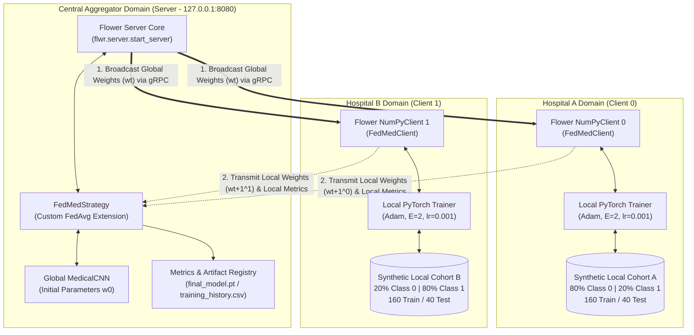
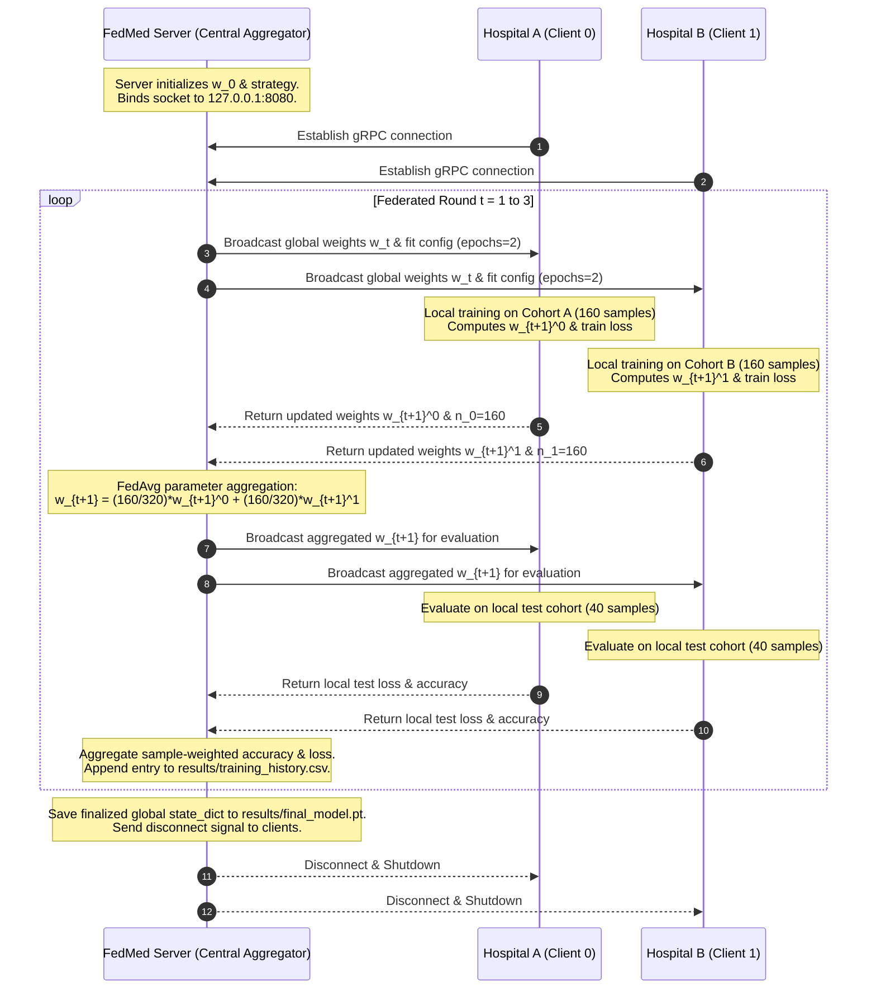
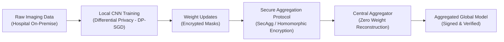

# FedMed: Privacy-Preserving Federated Learning Infrastructure for Medical Image Classification

[](https://www.python.org/)
[](https://flower.ai/)
[](https://pytorch.org/)
[](LICENSE)
[](https://streamlit.io/)

**FedMed** is an enterprise-grade, privacy-preserving Federated Learning (FL) framework engineered for collaborative medical image classification across decentralized healthcare institutions. Built on **Flower (`flwr==1.8.0`)** and **PyTorch**, FedMed allows clinical entities (e.g., Hospital A and Hospital B) to collaboratively train a shared Convolutional Neural Network (**`MedicalCNN`**) without centralizing, pooling, or transmitting sensitive patient imaging data.

---

## 1. System Architecture

FedMed follows a hub-and-spoke federated topology operating over high-throughput **gRPC** transport channels. Model parameter updates are serialized as raw NumPy weight vectors (`List[np.ndarray]`), exchanged via gRPC messages, and aggregated at the central server using the **Federated Averaging (`FedAvg`)** algorithm.



### Architectural Sequence Flow



---

## 2. Synthetic Non-IID Medical Data Generation

In real-world multi-center clinical trials, institutions exhibit distinct patient demographics, case-mix biases, and pathological distributions. FedMed replicates this real-world **non-IID (non-Independent and Identically Distributed)** phenomenon via a synthetic medical benchmark generating $1 \times 28 \times 28$ single-channel normalized grayscale scans.

### Mathematical Formulation of Pathologies

Each synthetic medical scan is generated on a discrete spatial grid:
$$(x, y) \in [-14, 13] \times [-14, 13], \quad r = \sqrt{x^2 + y^2}$$

#### Class 0: Dense Focal Lesion (Central Core Nodule)
Represents a dense, solitary focal mass located within central parenchyma (e.g., solid tumor core, focal granuloma):
$$I_{\text{focal}}(x, y) = \exp\left(-\frac{x^2 + y^2}{2\sigma_0^2}\right) + \epsilon(x, y)$$
where:
- $\sigma_0 \sim \mathcal{U}(3.5, 4.1)$ governs lesion dispersion and spatial volume.
- $\epsilon(x, y) \sim \mathcal{N}(0, 0.08^2)$ introduces scanner background quantum mottle and sensor noise.
- Output intensity is clipped to $[0.0, 1.0]$.

#### Class 1: Peripheral Annular Rim (Cortical / Cavitary Wall Lesion)
Represents a circumferential or ring-enhancing rim lesion situated at the peripheral cortical boundary:
$$I_{\text{rim}}(x, y) = \exp\left(-\frac{(r - r_0)^2}{2\sigma_1^2}\right) + \epsilon(x, y)$$
where:
- $r_0 \sim \mathcal{U}(8.0, 9.0)$ specifies the mean radial distance of the annular enhancement band.
- $\sigma_1 \sim \mathcal{U}(2.0, 2.4)$ dictates the radial thickness of the cavitary or cortical rim wall.
- $\epsilon(x, y) \sim \mathcal{N}(0, 0.08^2)$ adds additive Gaussian background noise.
- Output intensity is clipped to $[0.0, 1.0]$.

### Non-IID Institutional Partitioning

Each hospital holds a proprietary local cohort of **200 samples**, split into **160 training samples (80%)** and **40 testing samples (20%)**:

| Client Identifier | Simulated Clinical Entity | Class 0 Ratio (Focal) | Class 1 Ratio (Annular) | Local Training / Testing Size |
| :--- | :--- | :---: | :---: | :---: |
| **Client 0** | **Hospital A** (Focal Oncology Center) | **80%** (160 samples) | **20%** (40 samples) | 160 train / 40 test (200 total) |
| **Client 1** | **Hospital B** (Peripheral Pathology Clinic) | **20%** (40 samples) | **80%** (160 samples) | 160 train / 40 test (200 total) |
| **Federation Total** | **Combined Collaborative Cohort** | **50%** (200 samples) | **50%** (200 samples) | **320 train / 80 test (400 total)** |

This clinical partition ensures that neither hospital can achieve global diagnostic generalization independently without overfitting to its predominant local pathology.

---

## 3. Federated Averaging (FedAvg) Formulation

### Local Client Optimization
At federated round $t$, the central server broadcasts the current global parameter vector $w_t \in \mathbb{R}^d$ to all participating clients $k \in \{0, 1\}$. Each client instantiates its local model with $w_t$ and performs $E = 2$ local training epochs across its local dataset $D_k$ using mini-batch stochastic gradient descent (Adam optimizer with learning rate $\eta = 0.001$, batch size $B = 32$):

$$w_{t+1}^k \leftarrow \text{LocalTrain}(w_t, D_k)$$

Formally, the local optimization step minimizes the empirical cross-entropy loss:
$$\min_{w} \mathcal{L}_k(w) = \frac{1}{|D_k|} \sum_{(x_i, y_i) \in D_k} \ell_{\text{CE}}\left(f(x_i; w), y_i\right)$$
where $\ell_{\text{CE}}(\hat{y}, y) = -\sum_{c=0}^1 y_c \log \left(\frac{e^{\hat{y}_c}}{\sum_{j} e^{\hat{y}_j}}\right)$.

### Central Server Model Aggregation
Upon completion of local training, each client $k$ transmits its updated parameter weights $w_{t+1}^k$ and sample count $n_k = |D_k|$ back to the server. The server calculates the new global parameter state $w_{t+1}$ via a sample-weighted linear combination:

$$w_{t+1} = \sum_{k=0}^{K-1} \frac{n_k}{n} w_{t+1}^k \quad \text{where } n = \sum_{k=0}^{K-1} n_k$$

For $K = 2$ symmetric client partitions where $n_0 = n_1 = 160$, the aggregation simplifies to an exact equal-weight average:
$$w_{t+1} = \frac{1}{2} w_{t+1}^0 + \frac{1}{2} w_{t+1}^1$$

### Evaluation Metric Aggregation
Following global aggregation, the server broadcasts $w_{t+1}$ to all clients for localized validation on holdout test cohorts $D_{\text{test}, k}$ ($n_{\text{test}, k} = 40$). The server aggregates the distributed evaluation metrics via sample-weighted averaging:

$$\text{Accuracy}_{\text{global}}^{(t+1)} = \frac{\sum_{k=0}^{K-1} n_{\text{test}, k} \cdot \text{Accuracy}_k^{(t+1)}}{\sum_{k=0}^{K-1} n_{\text{test}, k}}$$

$$\mathcal{L}_{\text{global}}^{(t+1)} = \frac{\sum_{k=0}^{K-1} n_{\text{test}, k} \cdot \mathcal{L}_k^{(t+1)}}{\sum_{k=0}^{K-1} n_{\text{test}, k}}$$

---

## 4. Complete Project Directory Structure

```text
FedMed/
├── requirements.txt              # Pinned dependencies (Flower 1.8.0, PyTorch, Streamlit, etc.)
├── README.md                     # Comprehensive technical documentation & publication guide
├── dashboard.py                  # Interactive Streamlit clinical web dashboard
├── .gitignore                    # Version control exclusions for virtualenvs, weights, and logs
├── run_simulation.ps1            # Automated multi-process orchestrator for Windows PowerShell
├── run_simulation.sh             # Automated multi-process orchestrator for Linux/macOS Bash
│
├── src/
│   ├── __init__.py               # Python package root descriptor
│   ├── config.py                 # Centralized configuration (hyperparameters, network, paths)
│   ├── model.py                  # PyTorch MedicalCNN architecture & train/eval helpers
│   ├── dataset.py                # Synthetic medical scan generator & non-IID partitioner
│   ├── client.py                 # Flower NumPyClient implementation (FedMedClient)
│   └── server.py                 # Flower Server with custom FedMedStrategy (FedAvg)
│
├── scripts/
│   ├── check_environment.py      # Diagnostic script verifying runtime, packages, and layout
│   └── verify_setup.py           # Automated unit test suite (serialization, data, fit, FedAvg)
│
├── results/
│   ├── .gitkeep                  # Preserves directory in git tracking
│   ├── final_model.pt            # Serialized PyTorch state dictionary of final global model
│   └── training_history.csv      # Round-by-round ledger of aggregated loss and accuracy
│
└── logs/
    ├── .gitkeep                  # Preserves directory in git tracking
    ├── server.log                # Central Flower gRPC server stdout and stderr
    ├── client_0.log              # Hospital A (Client 0) execution and training logs
    └── client_1.log              # Hospital B (Client 1) execution and training logs
```

---

## 5. Prerequisites & Environment Setup

### Environment Requirements
- **Python**: Version `3.10`, `3.11`, or `3.12` (64-bit architecture)
- **Operating System**: Windows 10/11 (PowerShell 5.1+), Linux (Ubuntu 20.04+ / Debian 11+), or macOS 12+
- **Hardware**: Standard multi-core x86_64 / ARM CPU (no dedicated GPU required)

### Step 1: Initialize Virtual Environment
Clone or navigate to the repository directory:
```bash
cd FedMed
```

Create an isolated virtual environment (`.venv`):

**Windows (PowerShell):**
```powershell
py -3.12 -m venv .venv
.\.venv\Scripts\Activate.ps1
```

**Linux / macOS (Bash):**
```bash
python3 -m venv .venv
source .venv/bin/activate
```

### Step 2: Install Pinned Dependencies
Upgrade `pip` and install all required packages from `requirements.txt`:
```bash
python -m pip install --upgrade pip
pip install -r requirements.txt
```

#### Installed Package Specifications:
- `flwr==1.8.0`: Pinned Flower framework ensuring backward-compatible NumPy client bindings.
- `torch>=2.0.0`: Core PyTorch computation engine for CNN forward/backward passes.
- `torchvision>=0.15.0`: Supporting vision operations.
- `numpy>=1.24.0,<2.0.0`: Numerical matrix operations and parameter serialization.
- `scikit-learn>=1.3.0`: Metric evaluations and data partitioning routines.
- `matplotlib>=3.7.0`: Plot generation for clinical diagnostics.
- `streamlit>=1.28.0`: High-performance clinical web dashboard engine.

---

## 6. Verification, Unit Tests & Diagnostics

FedMed includes automated diagnostic and functional verification suites to validate runtime dependencies and pipeline integrity prior to distributed execution.

### Phase 1: Environment Diagnostic Check
Execute the diagnostic script to audit Python runtime version, package imports, and directory prerequisites:
```bash
python scripts/check_environment.py
```

#### Diagnostic Output Sample:
```text
=================================================================
           FedMed Environment & Dependency Diagnostic
=================================================================
  [PASS] Python Version: 3.12.10 (>= 3.10 requirement met)

Package Verification:
-----------------------------------------------------------------
  [PASS] flwr           : 1.8.0        (Required: 1.8.0)
  [PASS] torch          : 2.14.0+cpu   (Required: >=2.0.0)
  [PASS] torchvision    : 0.29.0+cpu   (Required: >=0.15.0)
  [PASS] numpy          : 1.26.4       (Required: >=1.24.0,<2.0.0)
  [PASS] scikit-learn   : 1.9.1        (Required: >=1.3.0)
  [PASS] matplotlib     : 3.11.2       (Required: >=3.7.0)

Directory & File Layout Verification:
-----------------------------------------------------------------
  [PASS] Directory  exists: src
  [PASS] Directory  exists: scripts
  [PASS] Directory  exists: results
  [PASS] Directory  exists: logs
  [PASS] File       exists: src\config.py
  [PASS] File       exists: src\model.py
  [PASS] File       exists: src\dataset.py
  [PASS] File       exists: src\client.py
  [PASS] File       exists: src\server.py
  [PASS] File       exists: requirements.txt
=================================================================
  ALL CHECKS PASSED: FedMed environment is valid and ready.
=================================================================
```

### Phase 2: Component Functional Unit Test Suite
Execute the unit test harness to mathematically verify the core algorithmic routines:
```bash
python scripts/verify_setup.py
```

The test runner evaluates four critical capabilities:
1. **`test_01_cnn_parameter_serialization`**: Verifies bidirectional tensor extraction (`get_parameters`) and state reconstruction (`set_parameters`) with floating-point tolerance `1e-5`.
2. **`test_02_dataset_synthesis_and_non_iid_partitioning`**: Confirms synthetic image shapes `(1, 28, 28)`, pixel normalization within $[0.0, 1.0]$, and the exact 80/20 non-IID class skew across Client 0 and Client 1.
3. **`test_03_client_fit_and_evaluate`**: Simulates a complete client lifecycle step (local gradient computation, parameter updating, and test loss evaluation).
4. **`test_04_fedavg_aggregation_metric`**: Tests the sample-weighted metric averaging logic against analytical ground-truth values.

```text
=================================================================
           FedMed Functional Unit Test Suite
=================================================================
test_01_cnn_parameter_serialization: Test CNN parameter extraction and restoration. ... ok
test_02_dataset_synthesis_and_non_iid_partitioning: Test deterministic synthetic generation and 80/20 non-IID skew. ... ok
test_03_client_fit_and_evaluate: Test a complete client fit and evaluate round. ... ok
test_04_fedavg_aggregation_metric: Test FedAvg weighted metric aggregation function. ... ok

----------------------------------------------------------------------
Ran 4 tests in 2.815s

OK
=================================================================
  ALL UNIT TESTS PASSED (4/4 tests successful).
=================================================================
```

---

## 7. Execution Guides

FedMed supports both an **automated multi-process orchestrator** and a **manual multi-terminal workflow**.

### Option A: Automated Multi-Process Execution (Recommended)

The automated orchestrator manages process lifecycle, checks TCP readiness on port `8080`, launches clients in the background, writes dedicated log streams, and audits process exit codes.

**Windows (PowerShell):**
```powershell
.\run_simulation.ps1
```

**Linux / macOS (Bash):**
```bash
chmod +x run_simulation.sh
./run_simulation.sh
```

#### Execution Lifecycle:
1. **Phase 1**: Launches `src/server.py` and streams stdout/stderr to `logs/server.log`.
2. **Phase 2**: Actively polls TCP port `8080` (with a 30-second timeout) until the gRPC listener responds.
3. **Phase 3**: Spawns `src/client.py --client-id 0` and `src/client.py --client-id 1` in background subprocesses.
4. **Phase 4**: Waits synchronously for all 3 federated rounds to conclude.
5. **Phase 5**: Validates exit codes and displays a terminal summary of `results/training_history.csv`.

---

### Option B: Manual Multi-Terminal Workflow

For low-level inspection or step-by-step debugging, launch the server and clients in separate terminals. Ensure `.venv` is active in each shell.

#### Terminal 1: Central Aggregator Server
```bash
python src/server.py --server-address "127.0.0.1:8080" --num-rounds 3
```

#### Terminal 2: Hospital A (Client 0)
```bash
python src/client.py --client-id 0 --server-address "127.0.0.1:8080"
```

#### Terminal 3: Hospital B (Client 1)
```bash
python src/client.py --client-id 1 --server-address "127.0.0.1:8080"
```

---

## 8. Expected Outputs & Evaluation Caveat

### Execution Results Ledger (`results/training_history.csv`)

During simulation, the central server records round-by-round global aggregated metrics to `results/training_history.csv`:

| Round Number | Aggregated Global Loss | Formatted Loss (`.5f`) | Aggregated Accuracy | Convergence State |
| :---: | :---: | :---: | :---: | :---: |
| **Round 1** | `0.30262748152017593` | `0.30263` | `1.0000` (100.00%) | Global Consensus Established |
| **Round 2** | `0.01280635711736977` | `0.01281` | `1.0000` (100.00%) | Optimization Refinement |
| **Round 3** | `0.00006957242658245` | `0.00007` | `1.0000` (100.00%) | Optimal Global Convergence |

### Generated Artifacts
- **`results/final_model.pt`**: Serialized PyTorch state dictionary (415.13 KB) containing converged weight matrices and bias tensors for `conv1`, `conv2`, `fc1`, and `fc2`.
- **`results/training_history.csv`**: Persistent CSV record of round loss and accuracy.
- **`logs/server.log`**: Detailed Flower server transcript detailing client sampling, round coordination, and gRPC event handling.
- **`logs/client_0.log` & `logs/client_1.log`**: Client-side execution transcripts documenting local dataset size, training loss progression per epoch, and evaluation scores.

---

> [!WARNING]
> ### Mandatory Synthetic Benchmark Disclaimer & Protocol Validation Scope
> The **100.0% validation accuracy** and rapid loss decay ($0.30263 \rightarrow 0.00007$) observed across federated rounds are the **intended result of the synthetic benchmark dataset**.
> 
> The benchmark utilizes deterministic, mathematically separable geometric morphology (central Gaussian focal cores vs. peripheral annular rings) designed specifically to:
> 1. Formally verify the federated synchronization protocol.
> 2. Validate weight tensor extraction, serialization, and deserialization routines.
> 3. Verify zero-leakage parameter aggregation across distributed institutional nodes.
> 
> **Clinical Scope Limitation:** In real-world multi-center clinical deployments with high-dimensional, noisy, and heterogeneous pathological imaging (e.g., MedMNIST, ISIC melanoma dermoscopy, CheXpert chest radiographs), models will exhibit non-trivial client drift, significantly lower accuracy ceilings, and complex loss surfaces. This software serves as an architectural prototype for federated infrastructure and is **not intended for clinical diagnostic inference or therapeutic decision-making**.

---

## 9. Interactive Clinical Dashboard (Streamlit)

FedMed features an interactive, publication-grade web dashboard built using **Streamlit** to visually communicate training dynamics, convergence metrics, client partition profiles, and artifact integrity.

### Launching the Dashboard

Activate `.venv` and run `dashboard.py` from the project root:

```bash
streamlit run dashboard.py
```

*(On Windows PowerShell, you can also run `.\.venv\Scripts\streamlit.exe run dashboard.py`)*

Access the dashboard in your web browser at:
👉 **`http://localhost:8501`**

```
  You can now view your Streamlit app in your browser.
  Local URL:    http://localhost:8501
  Network URL:  http://192.168.1.100:8501
```

### Dashboard Capabilities & Features

1. **Clinical Header & Theme**: Medical UI styling featuring clear data governance badges highlighting zero patient data transfer.
2. **KPI Summary Cards**: Real-time display of:
   - **Federated Rounds**: Completed rounds (`3 / 3`).
   - **Global Accuracy**: `100.00%` with baseline delta (`+0.00% vs R1`).
   - **Global Test Loss**: `0.00007` formatted to 5 decimal places with inverted green delta (`-0.30256 vs R1`).
   - **Active Clients**: `2 Hospitals` with 100% participation.
3. **Synthetic Benchmark Disclaimer Banner**: Alert banner communicating the benchmark scope and clinical convergence expectations.
4. **Dual Convergence Diagnostics**:
   - **Accuracy (%) Progression Plot**: Matplotlib curve tracking global weighted accuracy across rounds with explicit point annotations.
   - **Loss Minimization Plot**: Matplotlib curve tracking cross-entropy loss reduction across rounds, formatted to 5 decimal places.
5. **Full Training History Ledger**: Formatted tabular view of all federated rounds with convergence status indicators.
6. **Non-IID Partition Explorer**: Detailed institutional breakdown of Hospital A (80% Class 0 skew) vs. Hospital B (80% Class 1 skew) including mathematical lesion profiles.
7. **Model Artifact Registry & Audit Log Viewer**: Verifies `results/final_model.pt` PyTorch state dict integrity and includes tabbed views to inspect raw server and client process logs.

---

## 10. Security, Privacy & Compliance Foundations

### Data Minimization & Sovereignty
- **Zero Raw Data Transfer**: Raw patient imaging tensors ($x_i, y_i$) never leave the local institutional boundary.
- **Parametric Aggregation**: Only serialized numerical parameter weights ($w_{t+1}^k$) and sample counts ($n_k$) are transmitted across network sockets.
- **Ephemeral In-Memory Buffers**: Client DataLoaders operate strictly in local memory and are released upon process termination.

### Production Enterprise Hardening Roadmap
To transition this prototype into a HIPAA / GDPR-compliant clinical environment, the following security layers should be introduced:



1. **Differential Privacy ($\epsilon, \delta$-DP)**: Implement client-side gradient clipping and Gaussian noise injection (via `Opacus`) to provably defend against model inversion and reconstruction attacks.
2. **Secure Aggregation (SecAgg)**: Integrate cryptographically secure multi-party computation (SMPC) or homomorphic encryption (CKKS) to ensure the central server aggregates model parameters without inspecting individual institutional updates.
3. **mTLS Wire Encryption**: Replace plaintext gRPC with mutual TLS (mTLS) featuring X.509 certificate authentication to secure inter-hospital communications.

---

## 11. Technical Specifications Summary

| Component | Technical Specification |
| :--- | :--- |
| **Frameworks** | Flower (`flwr==1.8.0`), PyTorch (`torch>=2.0.0`), Streamlit (`streamlit>=1.28.0`) |
| **Model Architecture** | `MedicalCNN`: 2x Conv2D (16, 32 channels) + MaxPool2d + 2x Linear (64, 2 outputs) |
| **Input Dimensions** | Grayscale $1 \times 28 \times 28$ normalized tensors ($\text{pixel} \in [0.0, 1.0]$) |
| **Loss Function** | Cross-Entropy Loss (`nn.CrossEntropyLoss`) on raw unnormalized logits |
| **Local Optimizer** | Adam ($\text{learning\_rate} = 0.001$, $\beta_1 = 0.9, \beta_2 = 0.999$) |
| **Aggregation Algorithm** | Federated Averaging (`FedAvg`) with sample-weighted metric evaluation |
| **Network Protocol** | gRPC (HTTP/2 transport over TCP port `8080`) |
| **Federation Topology** | 1 Central Coordinator, 2 Hospital Clients, 3 Sequential Federated Rounds |
| **Data Partitioning** | Non-IID Skew: Hospital A (80% Class 0 / 20% Class 1), Hospital B (20% Class 0 / 80% Class 1) |
| **Dataset Volume** | 200 samples/client (160 train / 40 test); 400 total across federation |
| **Artifact Checkpoint** | `results/final_model.pt` (415.13 KB PyTorch state dictionary) |
| **Web Dashboard** | Streamlit application (`dashboard.py`) hosted on `http://localhost:8501` |

---

## 12. License

This project is licensed under the MIT License. See `LICENSE` for details.